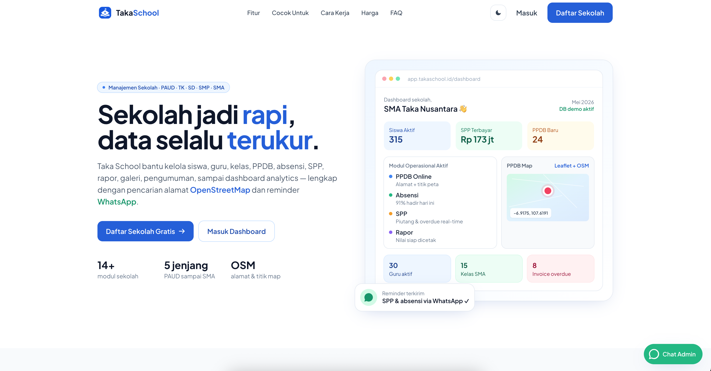
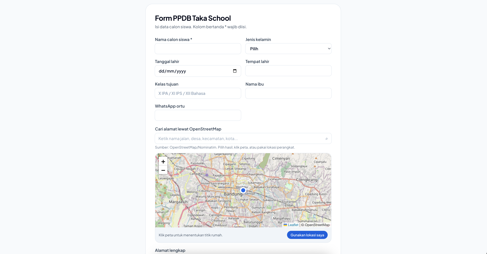
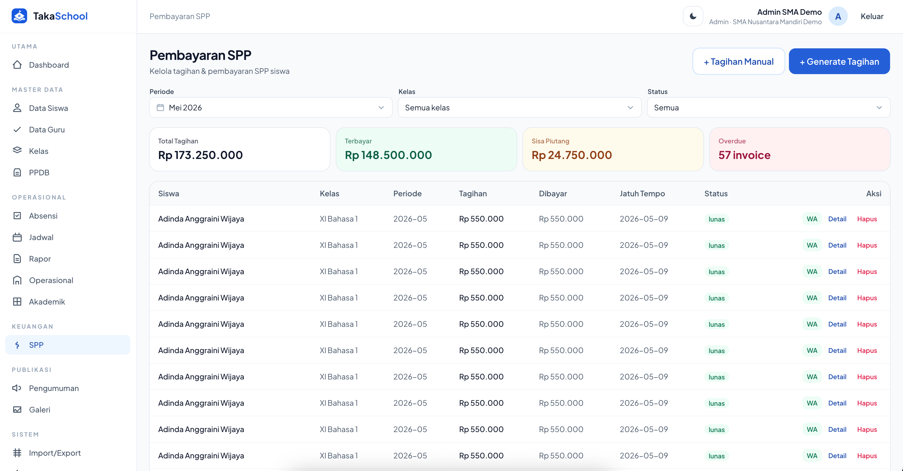

# Taka School

Taka School adalah aplikasi manajemen sekolah berbasis web untuk **PAUD, TK, SD, SMP, dan SMA**. Project ini memakai monorepo dengan frontend React dan backend Express/MySQL, sudah disiapkan dengan data demo SMA realistis, dashboard analytics, PPDB online, pembayaran SPP, akademik, absensi, rapor, galeri, dan portal publik.

## Preview Produksi Saat Ini

- App preview: `http://43.133.155.252:3000`
- PPDB publik: `http://43.133.155.252:3000/ppdb`
- Backend health: `http://43.133.155.252:3000/api/health`
- Database demo aktif: `taka-school-demo`

## Contoh UI

> Semua screenshot disimpan di `docs/images/` dengan nama file deskriptif agar mudah dipahami saat dibaca di GitHub.

### Landing Page — Hero + Preview Dashboard



### Dashboard Admin — Ringkasan Operasional Sekolah


### PPDB — Pencarian Alamat + Titik OpenStreetMap



### SPP — Dashboard Tagihan dan Pembayaran



## Fitur Utama

- **Multi-jenjang sekolah**
  - Mendukung PAUD, TK, SD, SMP, dan SMA.
  - Struktur kelas fleksibel untuk kebutuhan sekolah berbeda.

- **Dashboard analytics**
  - Ringkasan siswa, guru, kelas, absensi, pembayaran, dan tren operasional.
  - Chart dibuat custom SVG/CSS tanpa dependency chart eksternal.

- **Manajemen siswa**
  - CRUD data siswa.
  - Detail siswa.
  - Import/export data.
  - Field pendukung seperti NIS, NISN, wali/orang tua, WhatsApp, alamat, status, dan kelas.

- **Manajemen guru**
  - Data guru, NIP, kontak, email, dan mata pelajaran/spesialisasi.
  - Role guru untuk akses operasional.

- **Manajemen kelas**
  - Data kelas, wali kelas, kapasitas, dan detail anggota kelas.

- **PPDB online**
  - Form pendaftaran publik.
  - Pencarian alamat via **OpenStreetMap/Nominatim**.
  - Peta interaktif Leaflet + OpenStreetMap.
  - User bisa klik/drag titik lokasi untuk mendapatkan latitude/longitude.
  - Koordinat otomatis masuk ke catatan pendaftaran.

- **Absensi dan operasional harian**
  - Data absensi siswa.
  - Rekap operasional untuk dashboard.

- **SPP dan pembayaran**
  - Generate tagihan SPP per periode.
  - Tagihan manual.
  - Status: belum bayar, sebagian, lunas, lewat jatuh tempo.
  - Pembayaran/detail invoice langsung by ID.
  - Ringkasan Total Tagihan, Terbayar, Sisa Piutang, dan Overdue dihitung dari data SPP yang sedang tampil.
  - Reminder WhatsApp wali murid.

- **Akademik dan rapor**
  - Modul akademik.
  - Rapor siswa.
  - Detail rapor dan form input rapor.

- **Portal dan konten publik**
  - Landing page.
  - Portal publik.
  - Pengumuman.
  - Jadwal.
  - Galeri.

- **Role dan keamanan dasar**
  - Login admin/guru.
  - JWT auth.
  - Production guard: `JWT_SECRET` wajib kuat.
  - Production guard: `CORS_ORIGIN` tidak boleh wildcard `*`.
  - `.env` asli tidak boleh dicommit; gunakan `.env.example`.

- **AI-ready developer docs**
  - Struktur project jelas.
  - Plan/playbook tersedia di folder `.hermes/` lokal, namun folder ini di-ignore agar tidak ikut commit.

## Struktur Project

```text
.
├── server/                 # Express + TypeScript + MySQL API
│   ├── src/
│   │   ├── routes/         # API routes: auth, siswa, guru, kelas, SPP, PPDB, maps, dll.
│   │   ├── scripts/        # Seed data demo
│   │   ├── auth.ts         # JWT auth utilities
│   │   ├── db.ts           # MySQL connection pool
│   │   ├── index.ts        # Express app entry
│   │   └── schema.ts       # Auto-migrate schema
│   └── .env.example
├── web/                    # React + Vite + Tailwind frontend
│   ├── src/
│   │   ├── pages/          # Halaman aplikasi
│   │   ├── components/     # Reusable UI components
│   │   └── lib/api.ts      # API client
│   └── .env.example
├── database/
│   └── taka-school-demo.sql # Export database demo
├── docs/images/            # Screenshot UI untuk dokumentasi
├── .env.example            # Template env aman, tanpa secret asli
└── README.md
```

## Akun Demo

Data seed demo menggunakan akun berikut:

- Admin
  - Email: `admin@takaschool-demo.id`
  - Password: `demo12345`

- Guru
  - Email: `bu.siti.kurniawan@takaschool-demo.id`
  - Password: `demo12345`

> Jangan gunakan akun demo untuk produksi sungguhan tanpa mengganti password dan `JWT_SECRET`.

## Quick Start Lokal

```bash
# 1) Install dependency root + server + web
npm install

# 2) Salin environment example
cp server/.env.example server/.env
cp web/.env.example web/.env

# 3) Edit server/.env sesuai database lokal kamu
# DATABASE_URL=mysql://DB_USER:DB_PASSWORD@DB_HOST:3306/DB_NAME

# 4) Jalankan migrasi/schema
npm run migrate

# 5) Isi data demo
npm run seed

# 6) Jalankan backend + frontend dev
npm run dev
```

Default lokal:

- Frontend dev: `http://localhost:5173`
- Backend API: `http://localhost:4000`
- Health check: `http://localhost:4000/api/health`

## Environment

### Root `.env.example`

File `.env.example` di root hanya template gabungan agar mudah dibaca. Untuk runtime, gunakan file di folder masing-masing.

### Server `server/.env`

Contoh aman ada di `server/.env.example`:

```env
NODE_ENV=development
PORT=4000
DATABASE_URL=mysql://DB_USER:DB_PASSWORD@DB_HOST:3306/DB_NAME
JWT_SECRET=CHANGE_ME_USE_LONG_RANDOM_SECRET
CORS_ORIGIN=http://localhost:5173
```

### Web `web/.env`

Contoh aman ada di `web/.env.example`:

```env
VITE_API_BASE=http://localhost:4000
```

Untuk production dengan frontend dan backend satu origin/proxy, `VITE_API_BASE` bisa dikosongkan atau disesuaikan.

## Database Demo SQL

Export database demo tersedia di:

```text
database/taka-school-demo.sql
```

Import contoh:

```bash
mysql -u DB_USER -p -e "CREATE DATABASE IF NOT EXISTS \`taka-school-demo\`;"
mysql -u DB_USER -p taka-school-demo < database/taka-school-demo.sql
```

> File SQL ini berisi data demo. Jangan commit dump database produksi yang berisi data asli/sensitif.

## Scripts

```bash
npm install       # Install dependency root, server, dan web
npm run dev       # Jalankan server + web dev bersamaan
npm run dev:server
npm run dev:web
npm run build     # Build server + web
npm run start     # Start server production dari root
npm run migrate   # Jalankan auto-migrate schema
npm run seed      # Isi/update data demo idempotent
```

## Routes Frontend Penting

- `/` — Landing page publik
- `/login` — Login admin/guru
- `/dashboard` — Dashboard analytics
- `/siswa` — Manajemen siswa
- `/guru` — Manajemen guru
- `/kelas` — Manajemen kelas
- `/absensi` — Absensi
- `/spp` — Pembayaran SPP
- `/spp/baru` — Tagihan SPP manual
- `/spp/generate` — Generate tagihan SPP
- `/ppdb` — Form PPDB publik
- `/admissions` — Manajemen pendaftar PPDB
- `/akademik` — Akademik
- `/rapor` — Rapor
- `/pengumuman` — Pengumuman
- `/jadwal` — Jadwal
- `/galeri` — Galeri
- `/portal` — Portal publik
- `/import-export` — Import/export data

## API Backend Penting

- `GET /api/health`
- `POST /api/auth/login`
- `GET /api/auth/me`
- `GET /api/stats/dashboard`
- `GET /api/students`
- `GET /api/teachers`
- `GET /api/classes`
- `GET /api/admissions`
- `POST /api/admissions`
- `GET /api/maps/search?q=...`
- `GET /api/maps/reverse?lat=...&lon=...`
- `GET /api/spp`
- `GET /api/spp/:id`
- `POST /api/spp`
- `POST /api/spp/generate`
- `PUT /api/spp/:id`
- `DELETE /api/spp/:id`

## Stack

- Frontend: React 19, Vite, TypeScript, Tailwind CSS, React Router, Leaflet
- Backend: Express, TypeScript, MySQL2, bcryptjs, jsonwebtoken, zod
- Database: MySQL 8
- Maps: OpenStreetMap/Nominatim + Leaflet
- Deployment saat ini: systemd user service di port `3000`

## Production Notes

- Jangan commit `.env`, `.env.local`, kredensial database, JWT secret, atau token.
- `.hermes/` sudah masuk `.gitignore`.
- Production wajib memakai `JWT_SECRET` kuat.
- Production tidak boleh memakai `CORS_ORIGIN=*`.
- Jika memakai upload file secara serius, gunakan storage persisten seperti S3/Cloudinary, bukan filesystem ephemeral.
- Untuk reverse proxy/domain, arahkan ke service Taka School port `3000`.
